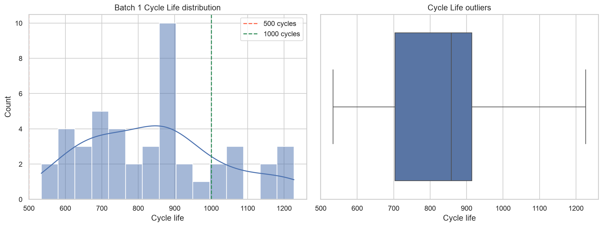
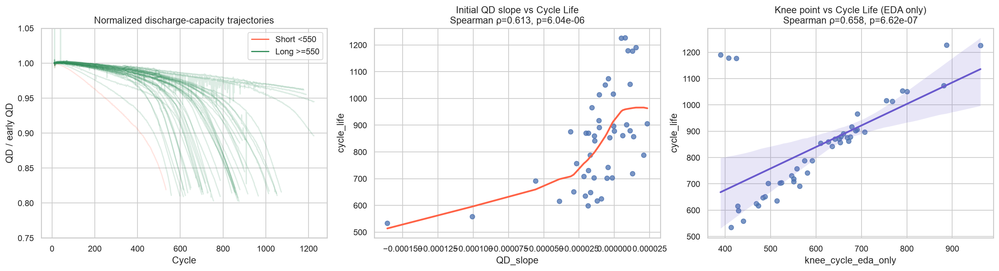
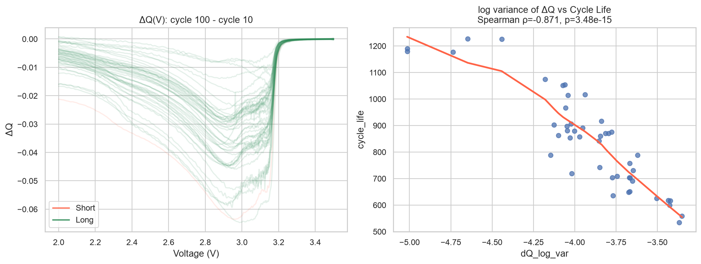
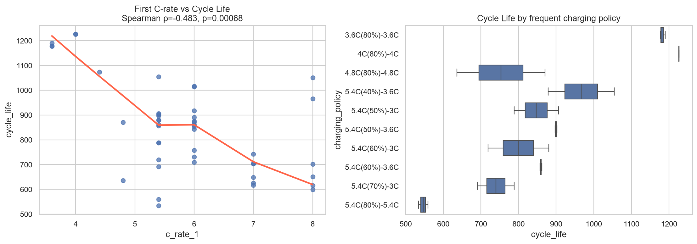
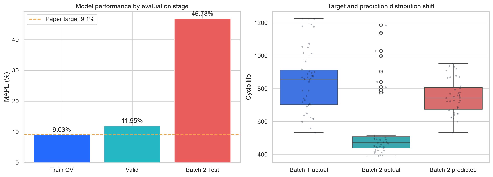
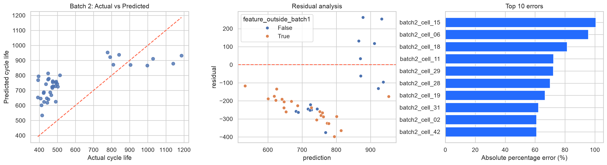
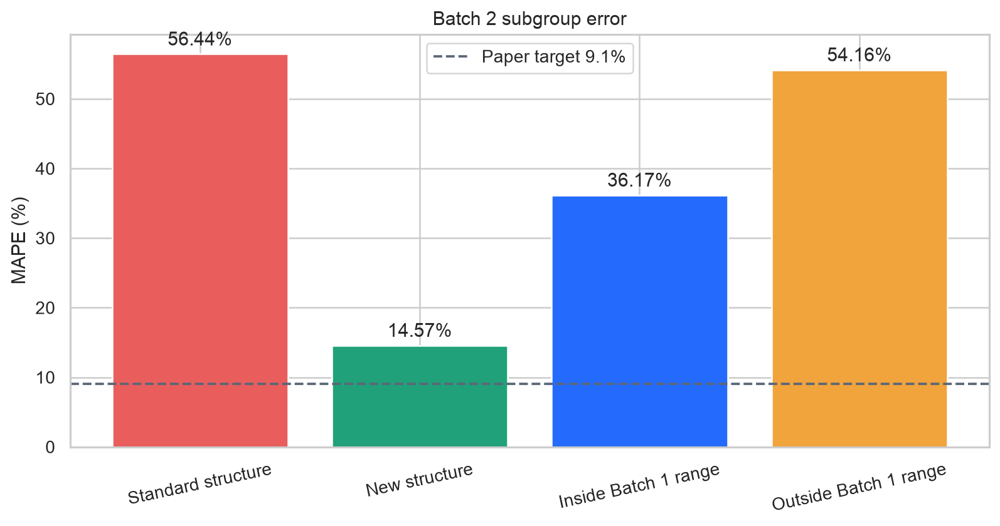

# ESS 배터리 수명 예측

| 캠퍼스명 | 캠퍼스 고유 번호 | 이름 |
|---|---|---|
| 울산 | U076 | 김대훈 |

초기 100사이클의 충·방전 데이터로 리튬이온 배터리의 최종 사이클 수명(`cycle_life`)을 예측하는 회귀 프로젝트입니다.

## 프로젝트 개요

- 데이터셋: MIT-Stanford Battery Dataset (Severson et al., 2019)
- 학습 데이터: Batch 1 (`2017-05-12`), 46개 셀
- 최종 평가: Batch 2 (`2018-02-20`), 정답이 있는 39개 셀
- 태스크: Regression
- Target: `cycle_life`
- 주요 평가 지표: MAPE
- 원논문 비교 기준: MAPE 9.1%

Batch 2 전체 47개 중 `cycle_life`가 없는 VarCharge·SlowCycle 8개 셀은 오차를 계산할 수 없어 성능 평가에서 제외했습니다.

## 빠른 실행 순서

### 1. 원본 데이터 배치

Git에는 원본 데이터가 포함되지 않습니다. 다음 MAT 파일을 `data/archive/`에 배치합니다.

```text
data/archive/2017-05-12_batchdata_updated_struct_errorcorrect.mat
data/archive/2018-02-20_batchdata_updated_struct_errorcorrect.mat
```

### 2. 환경 설정

```bash
git clone https://github.com/BigMacHun-del/mini_project.git
cd mini_project
python -m venv .venv
source .venv/bin/activate
pip install -r requirements.txt
jupyter notebook
```

### 3. 노트북 순차 실행

| 순서 | 노트북 | 역할 | 주요 생성 결과 |
|---:|---|---|---|
| 1 | `00_data_preparation.ipynb` | Batch 1 원본 파싱과 초기 피처 생성 | `data/processed/batch1_*` |
| 2 | `01_day1_eda_model_strategy.ipynb` | EDA, 가설 검정, 피처·모델 전략 | `results/feature_selection.csv` |
| 3 | `02_batch2_preparation.ipynb` | Batch 2에 동일한 전처리 적용 | `data/processed/batch2_*`, `results/batch_profile.csv` |
| 4 | `03_day2_modeling_evaluation.ipynb` | Ridge 학습, Valid, Batch 2 최종 평가 | 성능·예측 CSV, 저장 모델 |

노트북은 반드시 1→4 순서로 실행합니다. `*.executed.ipynb`에서는 데이터를 다시 실행하지 않고도 저장된 결과를 확인할 수 있습니다.

## 파일 구조

```text
mini_project/
├── data/                                  # Git 제외
│   ├── archive/                           # 원본 MAT 파일
│   └── processed/                         # 생성된 parquet/npz
├── notebooks/
│   ├── 00_data_preparation.ipynb
│   ├── 01_day1_eda_model_strategy.ipynb
│   ├── 02_batch2_preparation.ipynb
│   └── 03_day2_modeling_evaluation.ipynb
├── results/
│   ├── feature_selection.csv
│   ├── model_performance.csv
│   ├── batch2_predictions.csv
│   ├── batch2_subgroup_performance.csv
│   ├── ridge_coefficients.csv
│   └── models/
├── output/pdf/
│   └── DS-MINI-Design-울산캠퍼스_3반-김대훈.pdf
├── requirements.txt
└── README.md
```

`*.executed.ipynb`는 실행 결과가 저장된 노트북입니다.

## EDA 핵심 결과

### 1. Cycle Life 분포가 태스크 선택에 미친 영향



**관찰**

- Batch 1의 `cycle_life`는 534–1,227 cycles, 중앙값은 858.5입니다.
- 550 cycle을 기준으로 나누면 단수명 1개, 장수명 45개입니다.
- 모든 셀을 장수명으로 예측해도 Accuracy 97.8%가 되므로 분류 정확도가 실제 예측력을 과대평가할 수 있습니다.

**해석과 결론**

이진 분류는 클래스 불균형으로 정보 손실이 크므로, 각 셀의 연속적인 수명 차이를 학습하는 **Regression**을 선택했습니다.

### 2. 초기 방전 용량 변화



**관찰**

- `QD_slope=(QD_100-QD_10)/90`은 수명과 양의 관계를 보였습니다: Spearman ρ=0.613, p<0.001.
- 초기 방전 용량이 빠르게 감소하는 셀일수록 전체 수명이 짧아지는 경향이 나타났습니다.
- Knee point는 수명과 관계가 있지만 전체 수명 후반의 정보를 필요로 합니다.

**해석과 결론**

`QD_slope`은 초기 100사이클 안에서 계산할 수 있어 모델 입력으로 채택했습니다. Knee point는 미래 정보 누수를 일으키므로 EDA 해석에만 사용했습니다.

### 3. ΔQ(V) 곡선과 `dQ_log_var`



**관찰**

- Cycle 100과 Cycle 10의 방전 곡선 차이를 사용했습니다: `ΔQ(V)=Qdlin_100(V)-Qdlin_10(V)`.
- `dQ_log_var=log10(Var(ΔQ(V)))`는 수명과 가장 강한 단조 관계를 보였습니다: Spearman ρ=-0.871, p<0.001.
- `dQ_min`, `dQ_area`, `dQ_abs_area`는 `dQ_log_var`와 |ρ|=0.97–1.00의 높은 중복을 보였습니다.

**해석과 결론**

ΔQ 곡선의 변동이 클수록 초기 열화가 크고 수명이 짧았습니다. 약 1,000개의 곡선 값을 `dQ_log_var` 하나로 압축하고, 중복 파생 피처는 제거했습니다.

### 4. 충전 조건과 수명



**관찰**

- `c_rate_1`과 수명은 음의 관계를 보였습니다: Spearman ρ=-0.483, p<0.001.
- 충전 정책별 수명 분포 차이는 Kruskal-Wallis H=40.15, p=0.010으로 나타났습니다.
- 정책별 표본은 대부분 1–3개 셀입니다.

**해석과 결론**

초기 충전 속도와 정책은 수명 설명에 필요하므로 `c_rate_1`과 `chargetime_10`을 입력으로 사용했습니다. 표본이 작으므로 충전 속도의 인과 효과로 단정하지 않았습니다.

## 피처 엔지니어링

| 피처 | 유형 | 정의 | EDA 기반 선정 근거 |
|---|---|---|---|
| `dQ_log_var` | 파생 | `log10(Var(Qdlin_100-Qdlin_10))` | 수명과 가장 강한 관계, 곡선 차원 축소 |
| `QD_slope` | 파생 | `(QD_100-QD_10)/90` | 초기 방전 용량 감소율 |
| `chargetime_10` | 원본 추출 | Cycle 10 충전시간 | 충전 정책의 실제 충전 거동 반영 |
| `c_rate_1` | 원본 추출 | 충전 정책의 1차 C-rate | 초기 충전 스트레스 반영 |

이 조합은 ΔQ 변동, 용량 감소, 충전 시간, 충전 속도라는 서로 다른 정보를 담습니다. 파생 피처 간 공선성은 대표 피처 선택과 Ridge의 L2 규제로 다루었습니다.

## 분석 의사결정 기록

EDA 결과를 확인한 뒤 다음과 같이 분석 방향을 결정했습니다. 각 선택은 성능 수치만 보고 정하지 않고, 데이터 구조와 평가 과정에서 생길 수 있는 오류를 함께 고려했습니다.

| 판단 항목 | 확인한 근거 | 내가 내린 결정 | 결정 이유 |
|---|---|---|---|
| Regression 또는 Classification | 550 cycle 기준 클래스가 1:45로 불균형 | Regression 선택 | 다수 클래스만 예측해도 Accuracy 97.8%가 되어 분류 성능이 과대평가될 수 있고, 연속적인 수명 차이도 보존해야 함 |
| ΔQ 피처를 여러 개 사용할지 | `dQ_min`, `dQ_area`, `dQ_abs_area`, `dQ_log_var` 사이 절대 상관계수 0.97–1.00 | `dQ_log_var`를 대표 피처로 선택 | 중복 정보를 줄이면서 수명과 가장 강한 단조 관계(ρ=-0.871)를 유지하기 위함 |
| Knee point를 입력할지 | Knee point는 수명과 강한 관계가 있지만 수명 후반 데이터가 필요 | 모델 입력에서 제외 | 초기 100사이클만으로 예측한다는 목적에 맞지 않고 미래 정보 누수가 발생함 |
| 무작위 셀 분할을 사용할지 | 같은 충전 정책의 셀이 Train과 Valid에 함께 들어갈 수 있음 | `charging_policy` 기준 Group 분할 | 유사한 실험 조건을 암기해 검증 성능이 높아지는 위험을 줄이기 위함 |
| Linear 또는 Ridge를 사용할지 | Linear Group CV MAPE 9.48%, Ridge 9.03%; 피처 간 공선성과 소표본 존재 | Ridge를 최종 모델로 선택 | L2 규제로 계수 변동과 과적합 위험을 줄이면서 CV 성능도 개선됨 |
| Batch 2 결과를 보고 재튜닝할지 | Batch 2는 최종 Test이며 MAPE가 46.78%로 높음 | 피처·모델·`alpha`를 유지 | Test 결과를 학습 결정에 다시 사용하면 평가 데이터 누수가 생기므로, 성능 저하를 일반화 실패로 분석함 |

이 기록은 **EDA → 피처 선택 → 검증 설계 → 모델 선택 → 최종 평가**가 어떤 판단으로 연결되었는지를 보여줍니다.

## Modeling

### 검증 설계

1. Batch 1을 `charging_policy` 단위로 Train·Valid에 분리했습니다.
2. Train에서 중첩 GroupKFold로 Ridge `alpha`를 선택하고 CV 성능을 측정했습니다.
3. 결측치 처리와 표준화는 각 fold의 학습 부분에서만 fit했습니다.
4. 피처, Ridge, `alpha=3.1623`을 고정한 뒤 Batch 2를 최종 평가했습니다.

### Ridge 선정 근거

- Linear Regression Group CV MAPE: 9.48%
- Ridge Regression Group CV MAPE: 9.03%
- ΔQ 피처의 다중공선성으로 인한 계수 불안정을 L2 규제로 완화할 수 있습니다.
- 46개의 소표본에서 계수 크기와 모델 분산을 줄이는 선택입니다.

## 성능 결과



| 구분 | MAPE (%) | 비고 |
|---|---:|---|
| Train (Batch 1 CV) | 9.03 | Nested GroupKFold, fold MAPE 8.96 ± 2.21 |
| Valid (Batch 1 Hold-out) | 11.95 | 5개 충전 정책 Hold-out |
| Test (Batch 2) | 46.78 | 정답이 있는 39개 셀, 최종 평가 |
| Gap (Train-Valid) | +2.92 | Batch 1 내 과적합 가능성 |
| Gap (Valid-Test) | +34.83 | 배치 일반화 저하 |
| Gap (Target-Test) | +37.68 | 원논문 Target 9.1% 대비 |

**그래프 해석**

- Train과 Valid의 차이는 2.92%p인 반면 Valid와 Batch 2의 차이는 34.83%p입니다. 주요 문제는 Batch 1 내 과적합보다 배치 간 일반화입니다.
- Batch 1 실제 수명 중앙값은 858.5이지만 Batch 2는 472.0으로 낮아졌습니다.
- 모델의 Batch 2 예측 중앙값은 744.4로, 낮아진 실제 수명을 충분히 반영하지 못했습니다.

**결론**

Ridge는 Batch 1에서 Linear Regression보다 안정적이었지만, Batch 2의 타깃 분포 이동을 해결하지는 못했습니다. 원논문 9.1%와의 차이는 모델 자체뿐 아니라 데이터 분할·피처·배치 구조 차이를 함께 고려해야 합니다.

### 원논문 성능과 비교할 때의 조건

과제에서 제시한 원논문 Regression Target **MAPE 9.1%**와 본 프로젝트의 Test MAPE **46.78%**를 비교하면 차이는 **+37.68%p**입니다. 다만 이 값은 원논문 실험을 그대로 재현해 얻은 일대일 비교가 아니라, 과제에서 제공한 목표 성능과 현재 구현 결과 사이의 참고 비교입니다.

| 비교 조건 | 본 프로젝트 | 비교 시 의미 |
|---|---|---|
| 학습·평가 데이터 | Batch 1의 46개 셀로 학습, Batch 2에서 정답이 있는 39개 셀로 평가 | 사용 셀 수와 제외 기준이 원논문 재현 절차와 완전히 같다고 가정할 수 없음 |
| 입력 구간 | 초기 Cycle 10–100에서 계산 가능한 정보만 사용 | 미래 수명 정보를 사용하는 피처는 제외한 조기 예측 조건 |
| 입력 피처 | `dQ_log_var`, `QD_slope`, `chargetime_10`, `c_rate_1` 4개 | 원논문의 전체 피처 구성과 전처리를 그대로 복제한 실험이 아님 |
| 모델 | 표준화한 4개 피처의 Ridge Regression | 원논문의 모델·하이퍼파라미터·목표변수 변환을 동일하게 재현한 결과가 아님 |
| 내부 검증 | 충전 정책 단위 Nested GroupKFold와 정책 Hold-out | 동일 정책 셀의 혼입을 줄이기 위해 본 프로젝트에서 정한 보수적 검증 방식 |
| 최종 평가 원칙 | Batch 2 확인 전 피처·모델·`alpha` 고정, 1회 평가 | Test 성능을 보고 재튜닝하지 않아 최종 수치의 독립성을 유지 |

따라서 +37.68%p를 Ridge가 원논문 모델보다 그만큼 열등하다는 단일 원인으로 해석하지 않았습니다. 현재 실험에서 확인된 직접적인 결론은 **Batch 1에서는 약 9–12% MAPE를 보였던 관계가 수명 분포와 구조가 달라진 Batch 2에서 유지되지 않았다**는 것입니다. 공정한 재현 비교를 하려면 원논문과 동일한 셀 제외 기준, 데이터 분할, 피처 계산, 목표변수 변환, 모델 설정을 맞춘 별도 실험이 필요합니다.

## 오류 분석



**관찰**

- 좌측 Actual vs Predicted에서 실제 수명 400–500 구간의 대부분이 기준선 위에 위치합니다. 즉, 단수명 셀을 체계적으로 과대 예측했습니다.
- 중앙 잔차 그래프에서 Batch 1 피처 범위를 벗어난 셀이 음의 잔차에 많이 분포합니다. `residual=actual-prediction`이므로 음수는 과대 예측입니다.
- 최대 오차 셀은 `batch2_cell_15`로 APE 100.64%입니다.



| Batch 2 하위 그룹 | n | MAPE | 해석 |
|---|---:|---:|---|
| 일반 구조 | 30 | 56.44% | 실제 수명 저하를 반영하지 못함 |
| `newstructure` | 9 | 14.57% | 상대적으로 Batch 1 보정 관계와 유사 |
| Batch 1 피처 범위 내부 | 16 | 36.17% | 범위 내부에서도 완전한 일반화는 실패 |
| Batch 1 피처 범위 외부 | 23 | 54.16% | 외삽 구간에서 오차 확대 |

**오류 원인 결론**

가장 큰 오차는 수명이 392–474사이클인 Batch 2 일반 구조 셀을 650–815사이클로 과대 예측한 경우에서 발생했습니다. 단순히 몇 개의 이상치 때문이 아니라, Batch 1에서 학습한 **피처-수명 보정 관계가 Batch 2 일반 구조에서 이동한 것**이 주요 원인입니다.

## ESS 도메인 해석

| 분석 근거 | ESS 운영 해석 | 의사결정 |
|---|---|---|
| `dQ_log_var` ρ=-0.871 | 초기 방전 곡선에 수명 신호가 있음 | 초기 열화 위험 셀의 우선 점검 |
| `QD_slope` ρ=0.613 | 초기 용량 감소가 빠른 셀은 장기 수명이 짧을 가능성 | 팩 구성 전 열화 이상 셀 선별 |
| Batch 2 일반 구조 MAPE 56.44% | 다른 배치·구조에 기존 보정식을 직접 적용하면 위험 | 정기적 재학습과 구조별 보정 필요 |
| 피처 범위 외부 MAPE 54.16% | 학습 분포 밖의 셀은 예측 신뢰도가 낮음 | 범위 이탈 감지 시 수동 점검 또는 예측 보류 |

### 적용 가능 범위

현재 모델을 정확한 교체 시점 결정에 바로 사용하기에는 Batch 2 오차가 너무 큽니다. 다만 학습 조건과 유사한 셀에서는 초기 열화 위험 순위를 정하는 **선별 보조 지표**로 사용할 수 있습니다. 예측값 단독으로 셀을 폐기하거나 교체하는 의사결정은 적절하지 않습니다.

### 실제 배포 전 필요 조건

1. 셀 구조·제조 배치·충전 정책별 외부 검증
2. 학습 피처 범위 이탈을 감지하는 OOD 경고
3. 온도, 내저항, 부하 프로파일, 셀 간 불균형 피처 추가
4. 모델 예측 구간과 불확실성 제시
5. 신규 운영 데이터를 활용한 주기적 재학습·보정

## 참고문헌

- Severson, K. A. et al. (2019). Data-driven prediction of battery cycle life before capacity degradation. *Nature Energy*, 4, 383‑391.
